# Comandos

## pull

## run

- -it
Continua execução do container e acessa seu terminal iterativo

- -i
Reinicia container no modo iterativo (terminal interno)
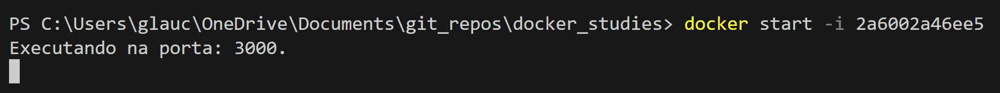

- -d
Executa container em segundo plano, liberando terminal
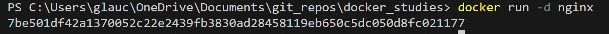

- -p
Indica portas do container | porta_local:porta_container
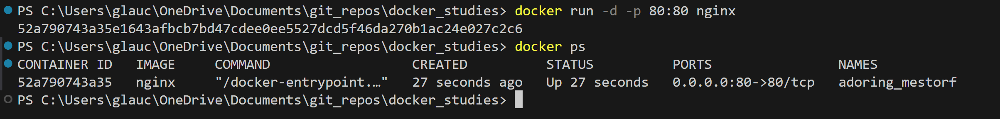
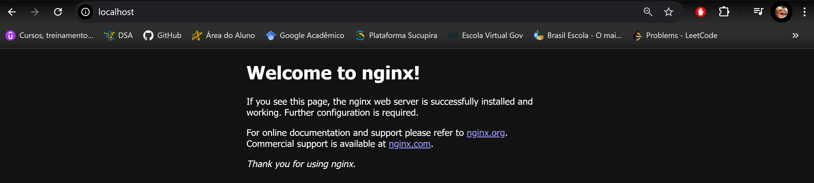

- --name
Nomeia um container
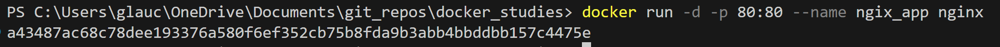

## ps

Exibe containers em execução
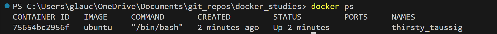

- -a
Exibe todos os containers já executados
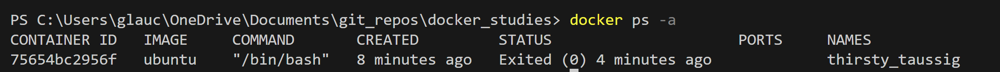

## exit

Finaliza container e sai do terminal interno
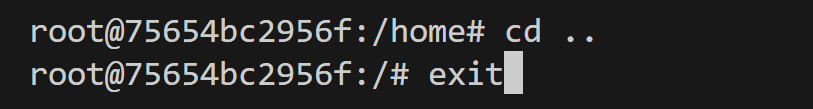

## stop "id ou nome"

Finaliza container
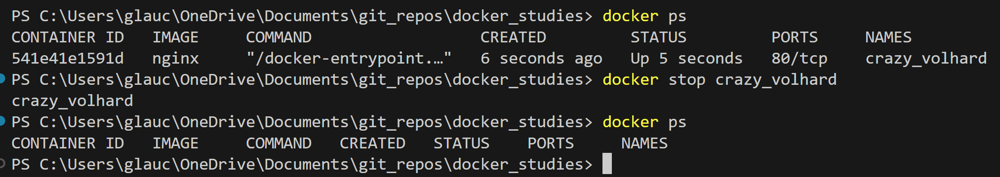

## start "id ou nome"

Reinicia um container já utilizado
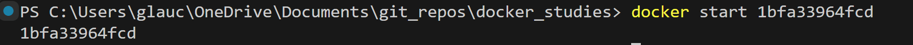

## logs

Verificando e fazendo manutenção em containers
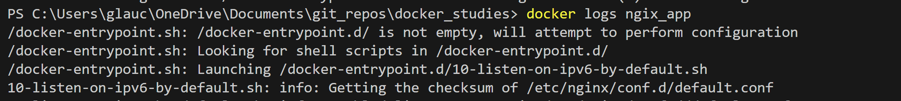
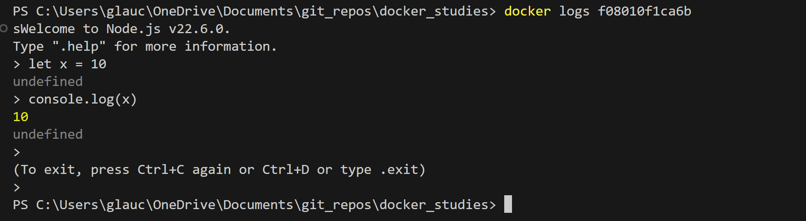

- -f
Execução em tempo real de logs
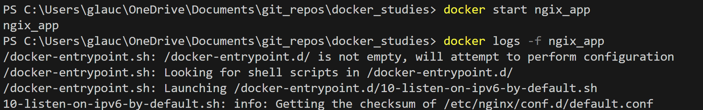

## rm "id ou nome"

Remove containers

- -f
remove container em execução
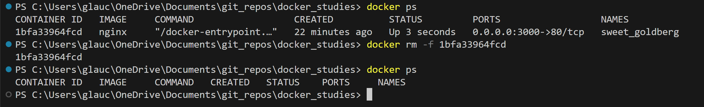

## Multiplas portas paralelas

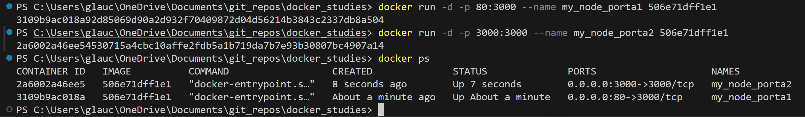
