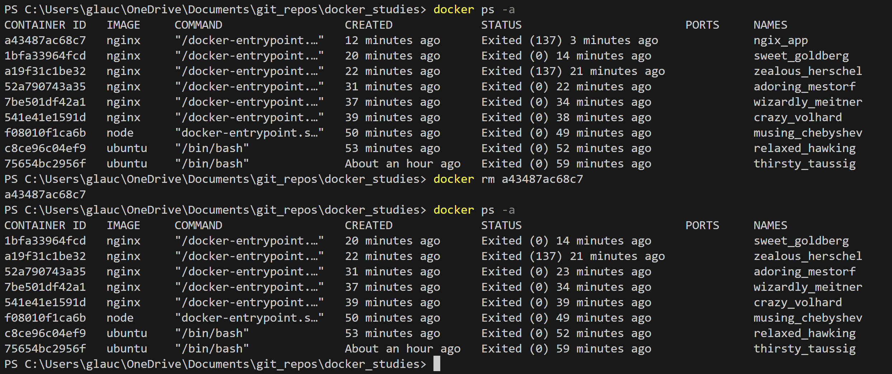

# Comandos

## pull

## run

- -it
Continua execução do container e acessa seu terminal iterativo

- -i
Reinicia container no modo iterativo (terminal interno)

- -d
Executa container em segundo plano, liberando terminal

- -p
Indica portas do container | porta_local:porta_container

- --name
Nomeia um container

## ps

Exibe containers em execução

- -a
Exibe todos os containers já executados

## exit

Finaliza container e sai do terminal interno

## stop "id ou nome"

Finaliza container

## start "id ou nome"

Reinicia um container já utilizado

## logs

Verificando e fazendo manutenção em containers

- -f
Execução em tempo real de logs

## rm "id ou nome"

Remove containers

- -f
remove container em execução

## Multiplas portas paralelas

