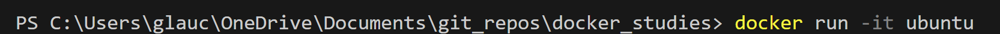

# Comandos

## pull

## run

### -it

Continua execução do container e acessa seu terminal

### ps

Exibe containers em execução

### exit

Finaliza container e sai do terminal interno

### ps -a

Exibe todos os containers já executados

