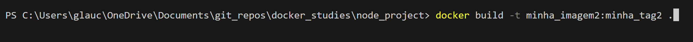
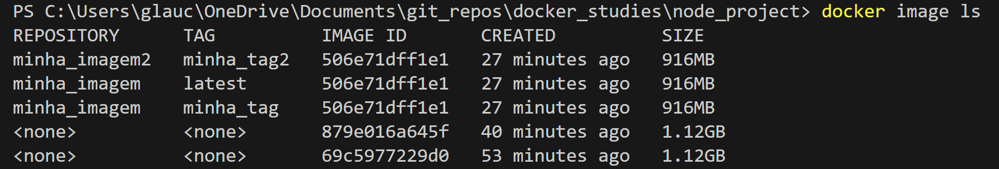
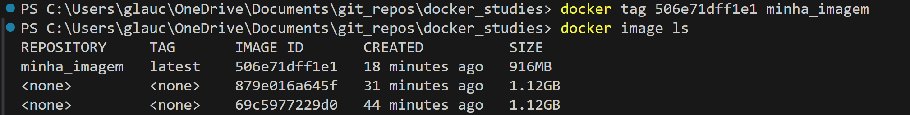
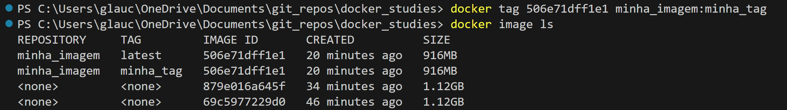
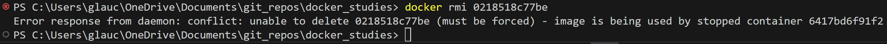
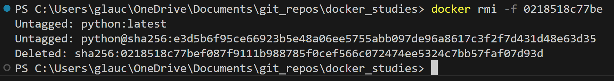

# Imagens

## build . -> monta imagem Dockerfile no diretório atual

- build "diretorio da imagem"
Monta imagem indicada

- -t
Monta imagem com nome e tag | nome:tag

## image

- ls
Lista imagens disponiveis

## Rodando minha imagem/container

## Alterando aplicação

Ao alterar a aplicação, é necessário remontar a imagem para efetivar as alterações

## tag "id" - nomeando imagens e tags

TAG -> indica a "versão" da imagem podendo ser usada assim: docker pull nome_imagem:tag_imagem

## rmi "nome ou id"

Remove imagem  
Caso a imagem tenha sido usada em um container, precisamos forçar a remoção

- -f
Força a remoção de uma imagem

