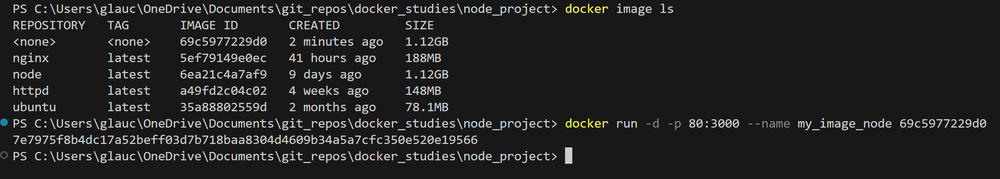

# Imagens

## build . -> monta imagem Dockerfile no diretório atual

- build "diretorio da imagem"
Monta imagem indicada

## image

- ls
Lista imagens disponiveis

## Rodando minha imagem/container

## Alterando aplicação

Ao alterar a aplicação, é necessário remontar a imagem para efetivar as alterações

