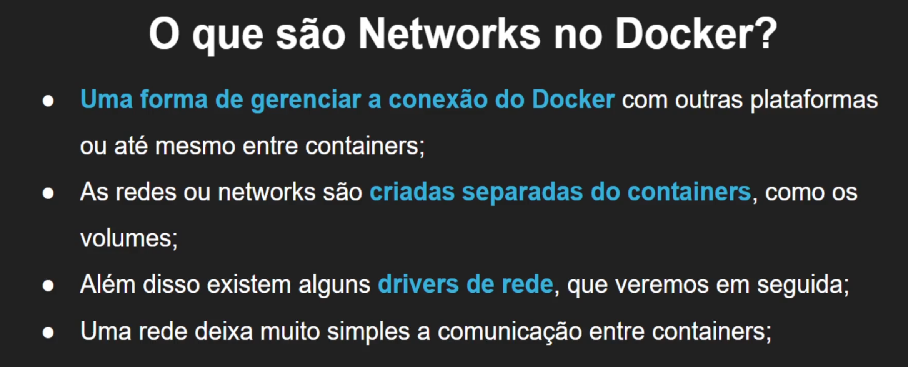
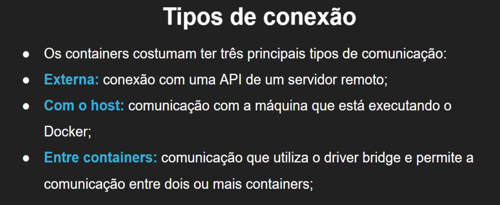
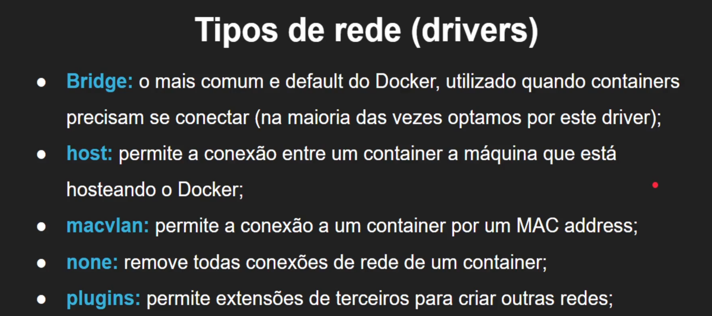
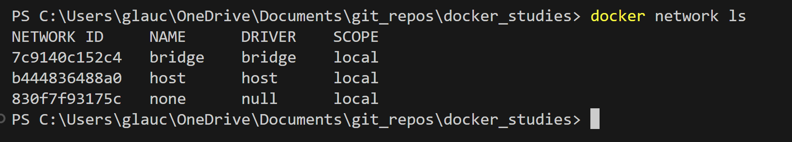
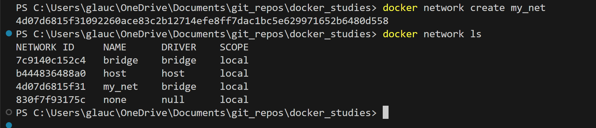
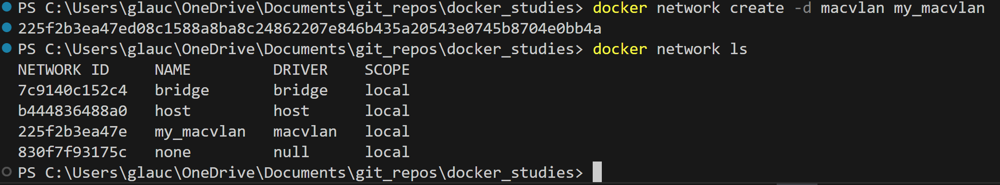
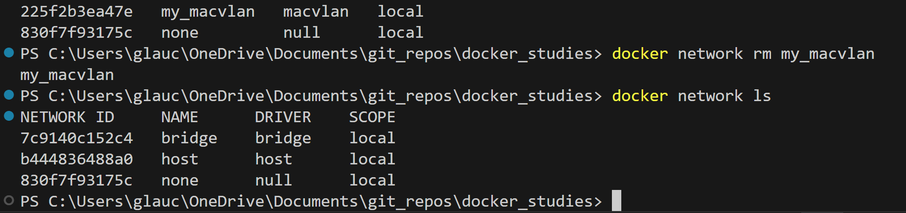
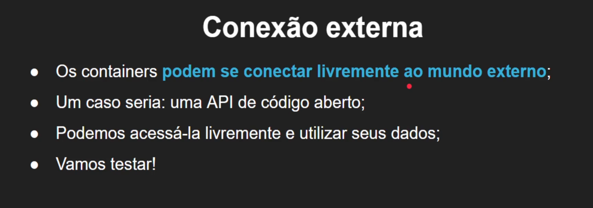
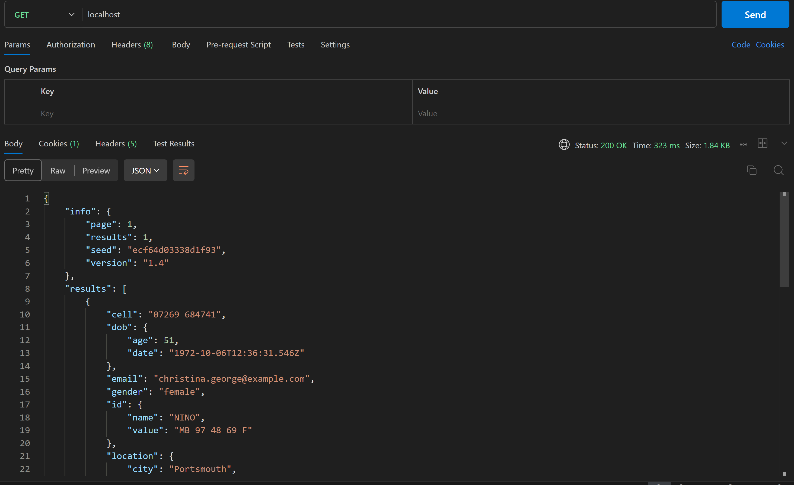

# Networks

- ls
lista as networks

- create "nome"
cria uma rede | use -d para indicar o driver

- rm "nome"
remove uma rede

## Conexão Externa

- container conectando a API
simulando app python

