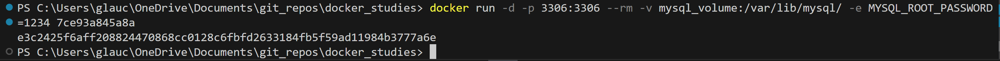

# Networks

- ls
lista as networks

- create "nome"
cria uma rede | use -d para indicar o driver

- network connect "rede" "container"
Conecta manualmente um container a uma rede

- rm "nome"
remove uma rede

## Conexão Externa

- container conectando a API
simulando app python

## Conexão host

- mysql container

  
Entre com a senha indicada no docker run  
[comandos mysql](https://www.diegobrocanelli.com.br/mysql/comandos-basicos-mysql-no-terminal/)  
CREATE DATABASE "nome_db"  

  
exit -> sai do terminal mysql

## Conexão entre containers

Crie um container mysql  
Crie um container de aplicação  
Crie uma network

- rodando containers  
Mysql container  
-e MYSQL_ALLOW_EMPTY_PASSWORD=True -> variavel de ambiente que permite senhas vazias  

flask container  

Execução da conexão

