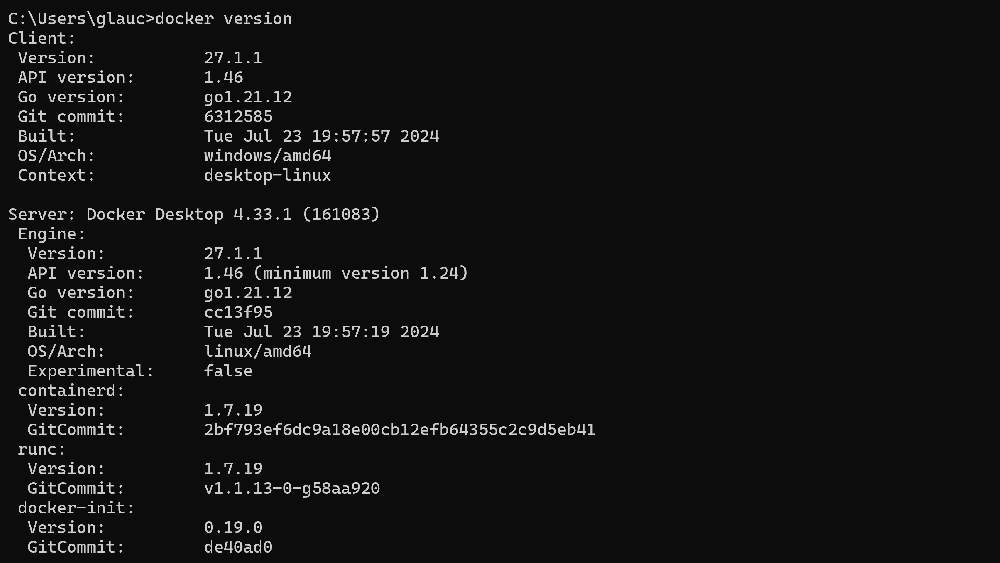

# docker_studies

Estudos com Docker

## Tools

- [Docker Doc](https://docs.docker.com/)
- [Opção de terminal - cmder](https://cmder.app/)
- [Docker images](https://hub.docker.com/)

## Validando Instalação

## Camadas Dockerfile

## system prune

Remove containers, imagens e networks não utilizadas

## stats

Mostra dados quanto aos processos em andamentos, incoluindo recursos utilizados

