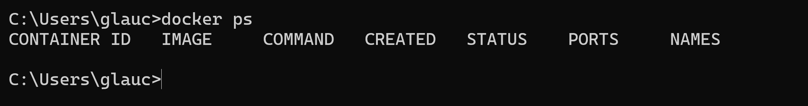
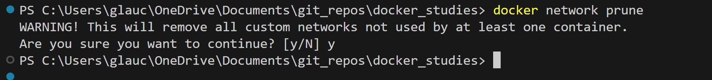

# docker_studies

Estudos com Docker

## Tools

- [Docker Doc](https://docs.docker.com/)
- [Opção de terminal - cmder](https://cmder.app/)
- [Docker images](https://hub.docker.com/)
- [postman](https://www.postman.com/)
- [data API](https://randomuser.me/api)

## Validando Instalação

## Camadas Dockerfile

## system prune

Remove containers, imagens e networks não utilizadas

- volume prune
remove todos os volumes não utilizados

- network prune
remove todas as redes nao utilizadas

## stats

Mostra dados quanto aos processos em andamentos, incoluindo recursos utilizados

