# Volumes

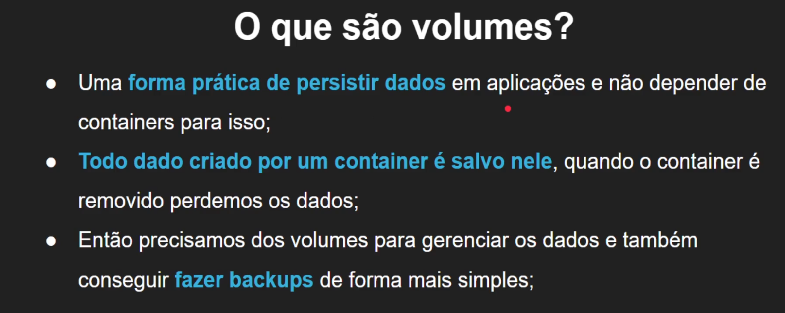
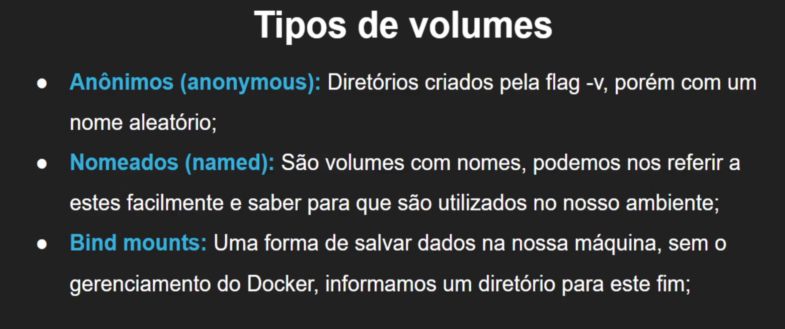

## Volumes anonimos

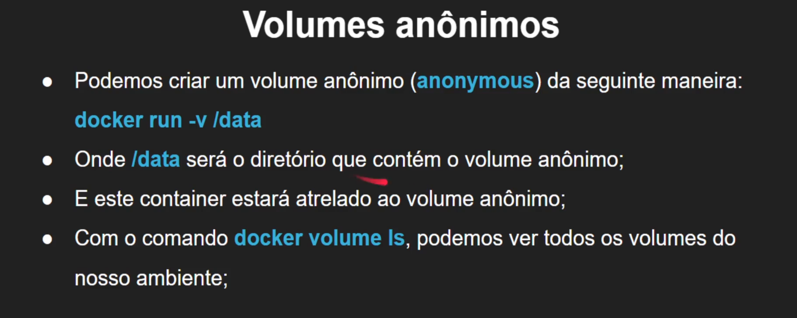

- docker run -v /data
criando volume anonimo
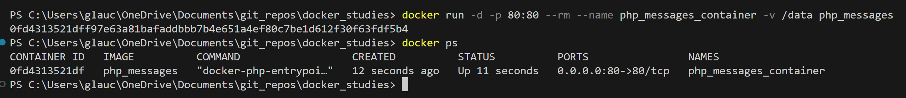

- volume ls
lista volumes
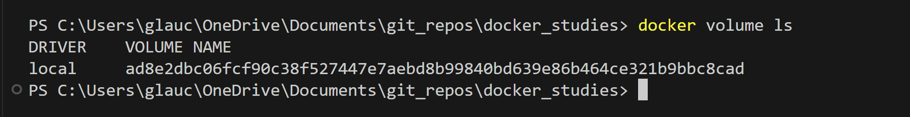
volume listado no docker inspect
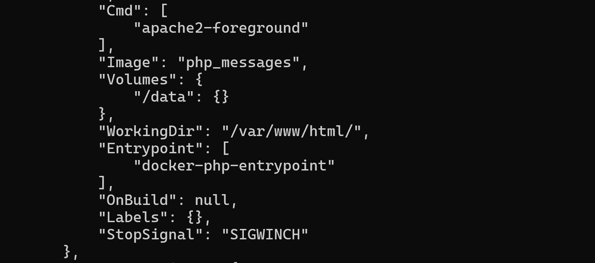

## Volumes nomeados

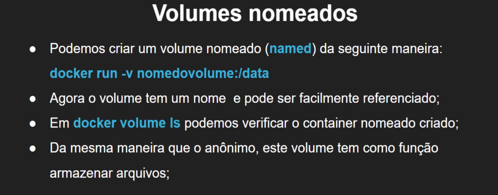

- docker run -v nome_volumes:/dir_volume
o diretorio deve respeita o indicado na camada WORKDIR do Dockerfile
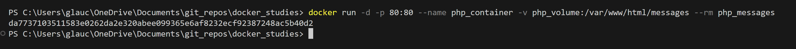
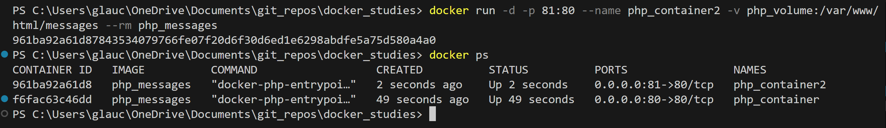

## Bind mount

Possibilita persistir dados em tempo real
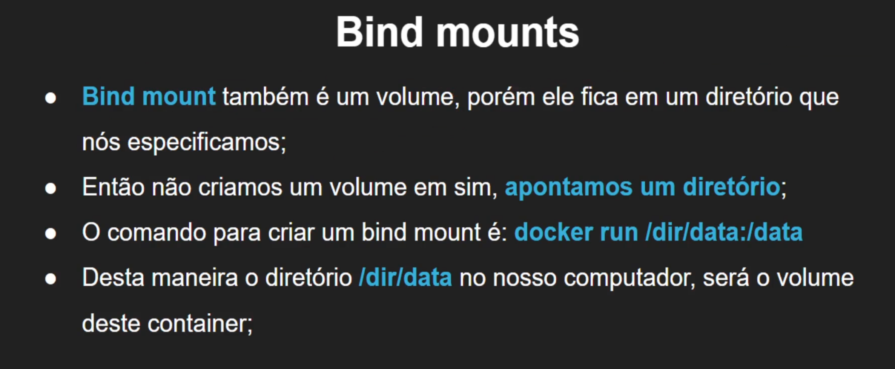

- docker run -v diretorio_local:diretorio_container
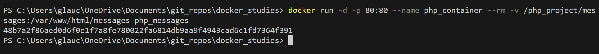

- erro com permissões
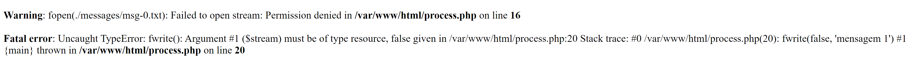
execute o /bin/bash do container
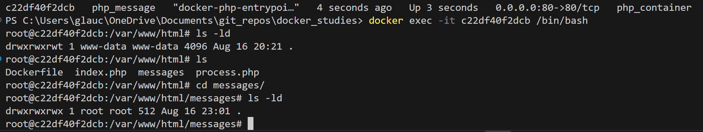
verifique e altere as permissoes

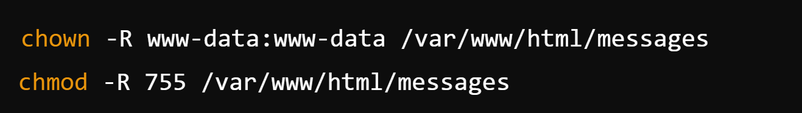
