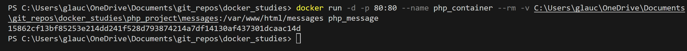
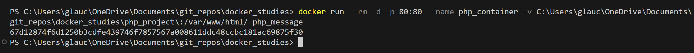
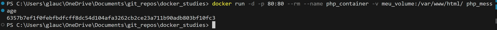
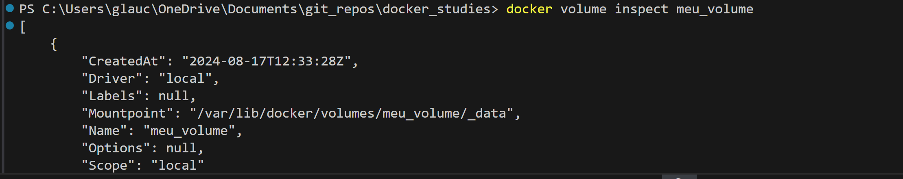
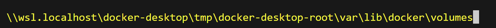
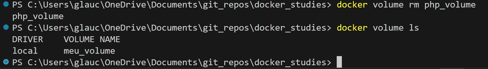

# Volumes

## Volumes anonimos

- docker run -v /data
criando volume anonimo

- volume ls
lista volumes

volume listado no docker inspect

## Volumes nomeados

- docker run -v nome_volumes:/dir_volume
o diretorio deve respeita o indicado na camada WORKDIR do Dockerfile

## Bind mount

Possibilita persistir dados em tempo real

- docker run -v diretorio_local:diretorio_container

- erro com permissões

execute o /bin/bash do container

verifique e altere as permissoes

outra opção é utilizar o caminho absoluto da pasta local

## Bind mount | atualizando projreto em tempo real

para isso, copie todo o projeto

## volume create "nome"

criando volumes nomeados manualmente

## volume inspect "nome"

inspecionando volumes

## volume rm "nome"

removendo volumes

