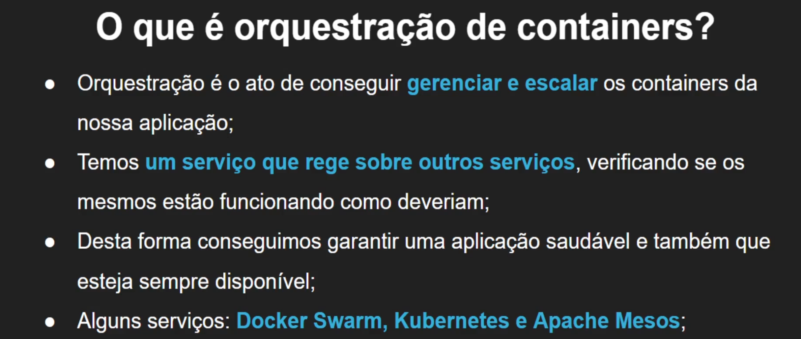
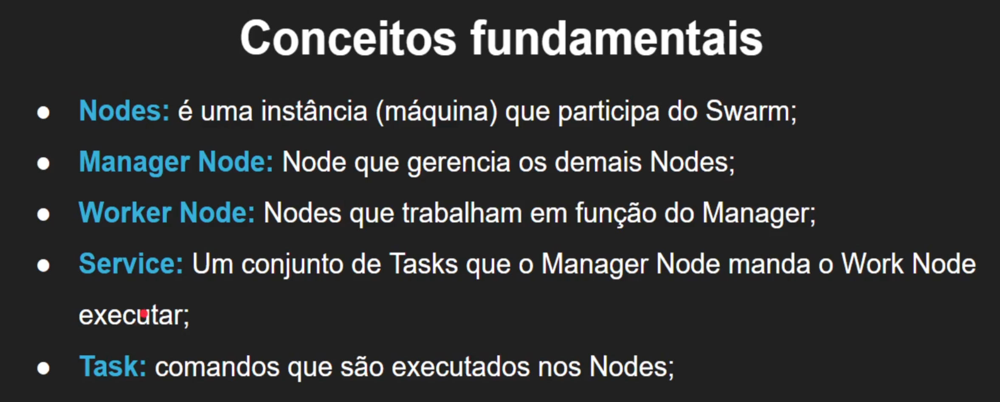
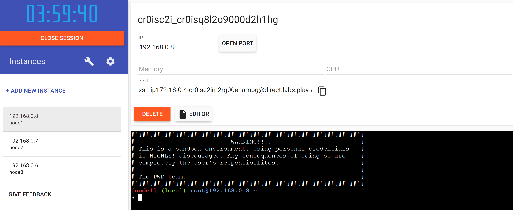
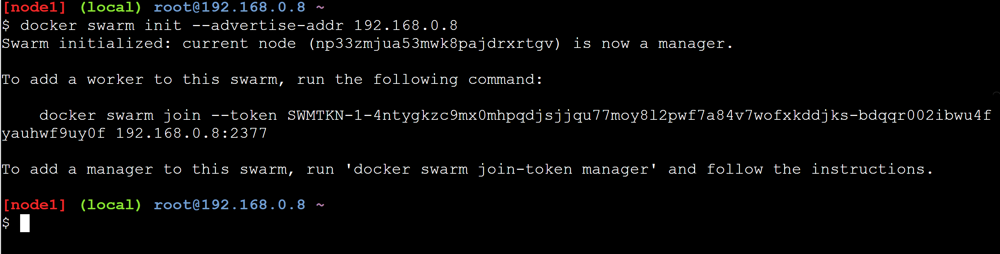
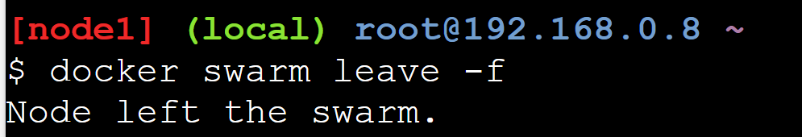
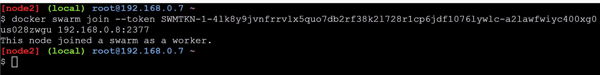
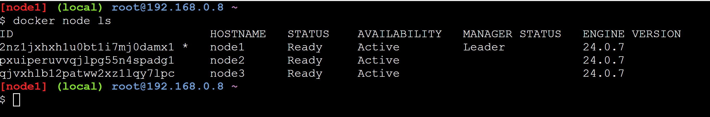

# Docker Swarm

## Tools

- [lab docker](https://labs.play-with-docker.com/)

## Inicie instancias

## comandos

- start  
Indique o ip addres do node manager

- leave -f  
força saida de um swarm

- node ls
lista nodes

## node como worker

Use a chave token do node manager

