# Docker Swarm

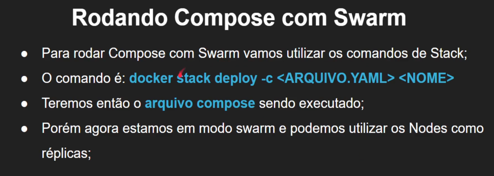
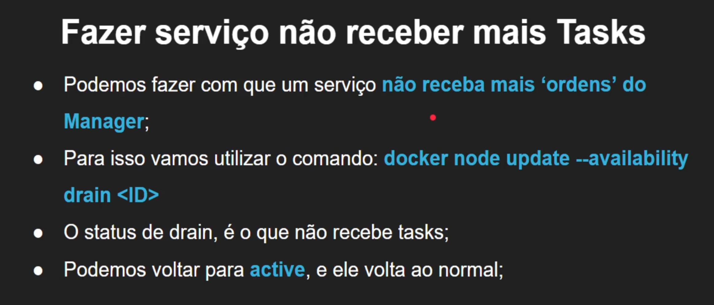
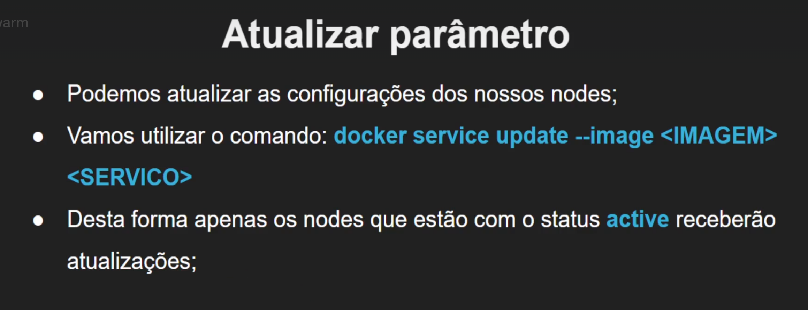

## Tools

- [lab docker](https://labs.play-with-docker.com/)
- [swarm commands](https://medium.com/docker-um-canivete-su%C3%ADco/docker-principais-comandos-%C3%BAteis-a37639a432d5)

## Inicie instancias

## comandos Nodes

- start  
Indique o ip addres do node manager

- leave -f  
força saida de um swarm

- docker node rm "node" | -f  
remove node do swarm já desabilitado com swarm leave  
para retorna com um node, pode ser necessário reiniciar toda a infraestrutura
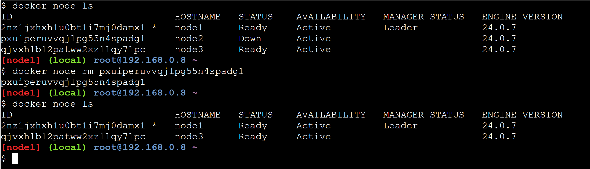

- node ls
lista nodes

- docker info  
retorna inforamções gerais de docker (configurações)
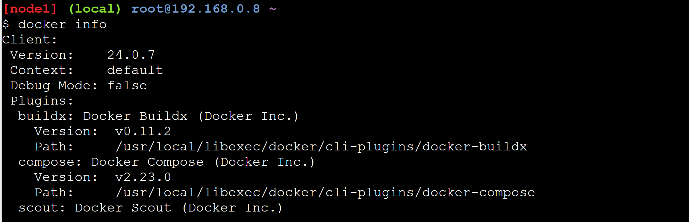

## node como worker

Use a chave token do node manager

- join-token manager  
recupera token do manager

## Availability de nodes

- update --availability "status" "node"  
atualiza status de node
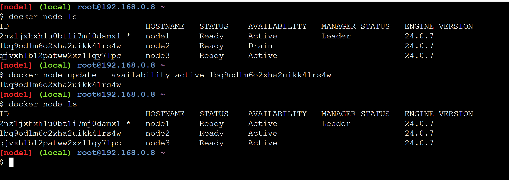

- "drain"  
faz com que o node não receba mais tasks

- "active"  
availability padrão | funcional

## Adicionando e manipulando serviços e containers

- docker service ls  
listando serviços  

- docker service rm "servico"  
encerra serviços

- service inspect "service" e service ps  
retorna informações sobre o serviço
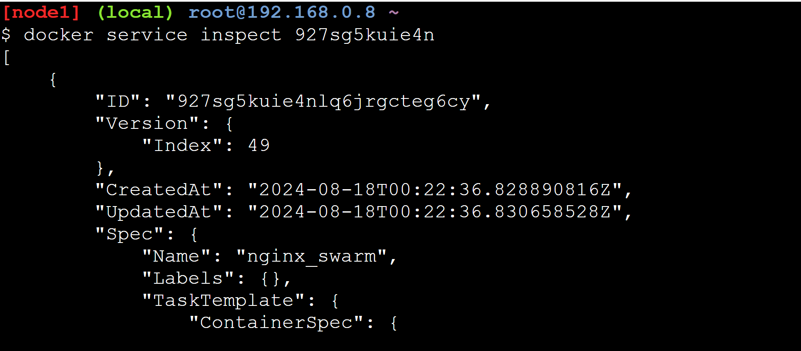
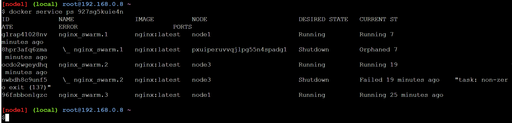

- --replicas | tasks  
Indica qtd de replicas para nodes

- derrubando container worker (Manager o reinicia)  

- service update | atualiza serviços  
atualizando imagem | APENAS PARA NODE com availability ACTIVE
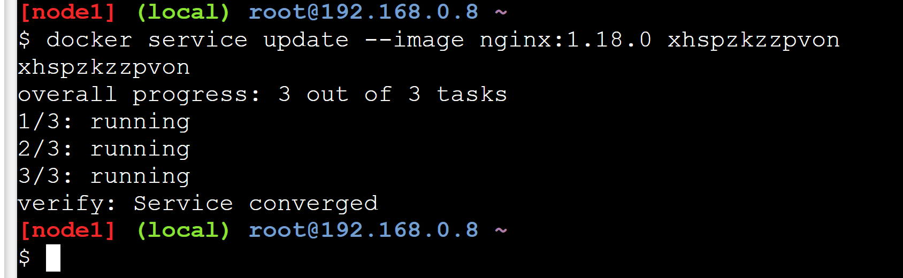

## Docker compose

- vim "arquivo"  
cria arquivos via terminal | tecle "i" para iniciar modo de edição

esc, :, x, ! => salvar arquivo

- -c "composer_file"  
sobe serviço docker-compose
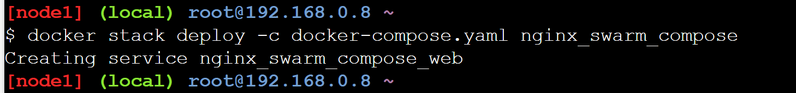

- service scale "servico"="replicas"  
cria replicas do serviço (escala aplicação)
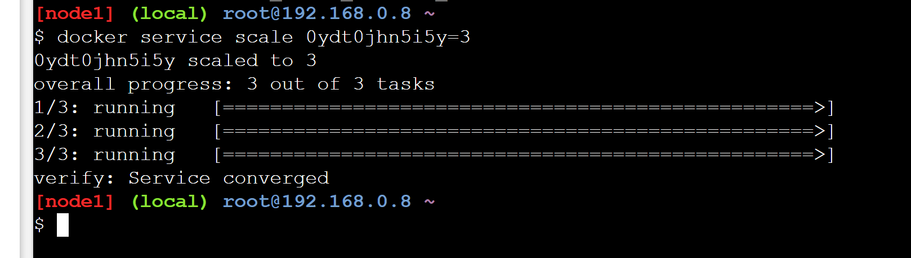
