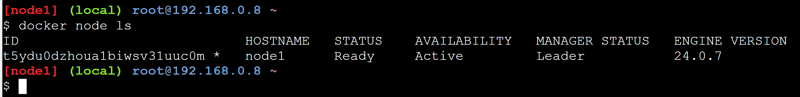
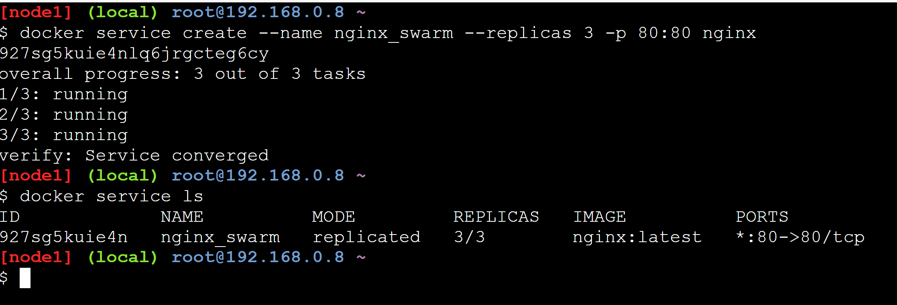

# Docker Swarm

## Tools

- [lab docker](https://labs.play-with-docker.com/)
- [swarm commands](https://medium.com/docker-um-canivete-su%C3%ADco/docker-principais-comandos-%C3%BAteis-a37639a432d5)

## Inicie instancias

## comandos

- start  
Indique o ip addres do node manager

- leave -f  
força saida de um swarm

- node ls
lista nodes

## node como worker

Use a chave token do node manager

- join-token manager  
recupera token do manager

## Adicionando e manipulando serviços e containers

- docker service ls  
listando serviços  

- docker service rm "servico"  
encerra serviços

- --replicas | tasks  
Indica qtd de replicas para nodes

- derrubando container worker (Manager o reinicia)  

