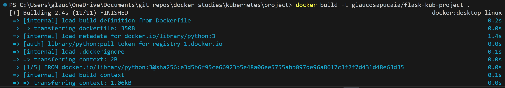
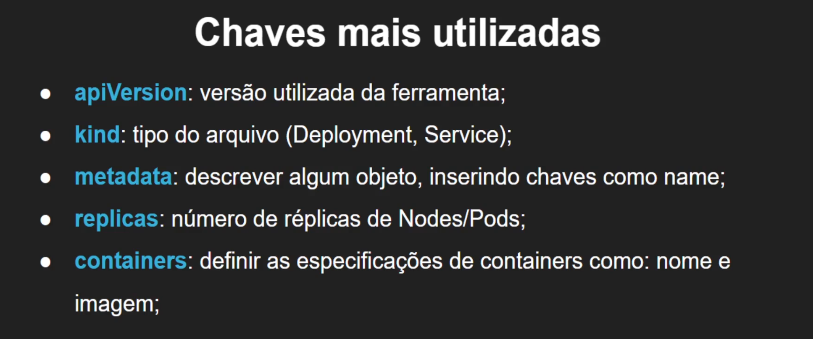
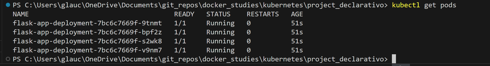

# Kubernetes

## Tools

- [chocolatey | Windows](https://chocolatey.org/)
- [kubernetes tools](https://kubernetes.io/docs/tasks/tools/)
- [minikube](https://minikube.sigs.k8s.io/docs/start/?arch=%2Fwindows%2Fx86-64%2Fstable%2F.exe+download)

## Minikube

- start --driver="driver"  
inicia minikube

- status  
checa status do minikube  

- stop  
encerra minikube

- dashboard | --url  
obtendo informações gerais do projeto | kubernetes painel

## Project

### Build e push Dokcker file (docker hub)

- build e push para docker hub  
nomeie já para utilizar o Docker Hub

### Deployments

- deployment | kubectl create deployment "nome" --image="image"  
criando deploy do projeto via kubernetes

- get deployents | describe deployments
retorna deployments e seus detalhes

- scale deployments/"nome" --replicas="numero"
escalando aplicanção com pods  
podemos também indicar um numero menor de replicas do que há, assim,  
realizamos o SCALE DOWN da aplicação

- delete deployment "nome"  
exclui um deployment e interrompe todos os PODs

#### Atualizando imagens

É necessário incluir uma tag na build para diferenciar as versões  
Faça o push (docker hub) da nova imagem:tag  
Pegue o nome do container/pod no dashboard  

- set image deployment/"nome_deployment" "nome_container"="imagem"  

#### Desfazendo ações erradas

Atualizando imagem como nome errado  

- rollout status deployment/"nome"  
verifica alterações

- rollout undo deployment/"nome"  
desfaz alterações

### Pods

- get pods | describe pods  
retorna pods e seus detalhes

### Kubernetes Config

- config view  
retorna informações da infraestrutura (kubernetes/minikube)

### Services

#### --type

LoadBalancer -> aplica o servilço para TODOS os PODS  

- expose deployment "nome" --type="tipo" --port="port"  
cria serviço expondo container ao mundo externo

- minikube service "nome"  
gera IP Address para acessar service dos pods  
o nome do serviço criado é igual ao do deployment  
existem várias formas, dependendo do serviço utilizado (minikube, AWS, Azure, etc)  

- get services | describe services/"nome"
retornas services e seus detalhes

- delete service "nome"  
encerra serviço

## Modo Declarativo

### Deployment

- apply -f "file.yaml"  
executa o arqvuio declarativo

- delete -f "file.yaml"  
encerra o deployment

### Service

- apply -f "file-service.yaml"  
Execute o serviço de modo declarativo  
obtenha o ip address para acesso (minikube)

- delete -f "file-service.yaml"  
encerra serviço

### Atualizando imagem

Após alterações, faça o build novamente  
Faça o push para o docker hub  
Atualize o arquivo de deployment .yaml  
Faça p apply -f com o arquivo .yaml de deploy alterado  

### Unindo arquivos yaml

Separe o conteudo do arquivo .yaml com "---"

- apply -f "file.yaml"  
Executa o arquivo global

